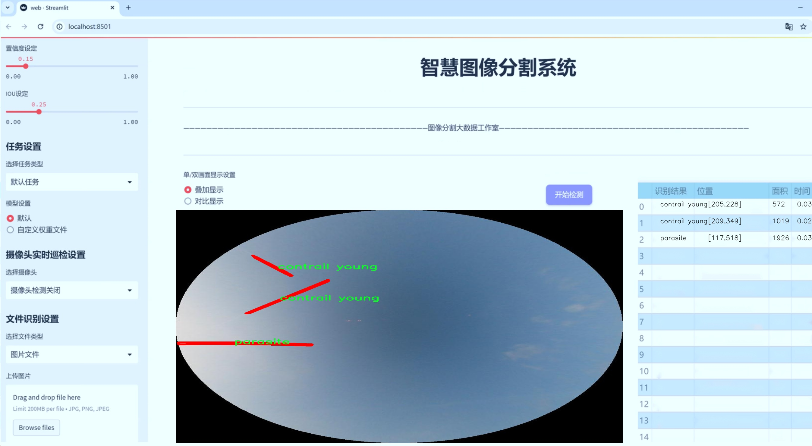
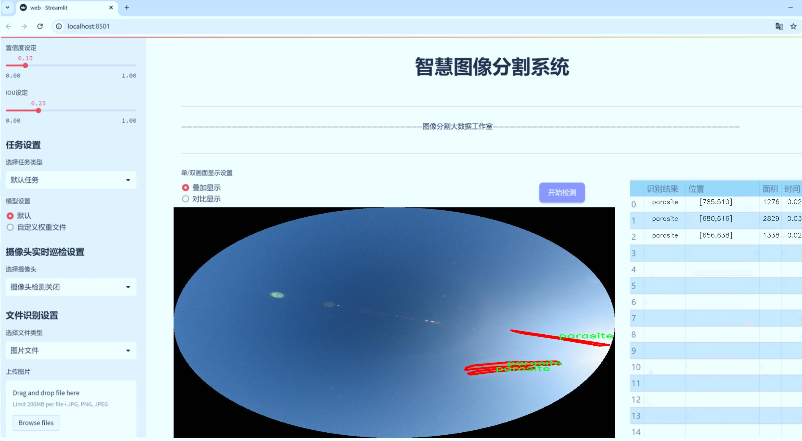
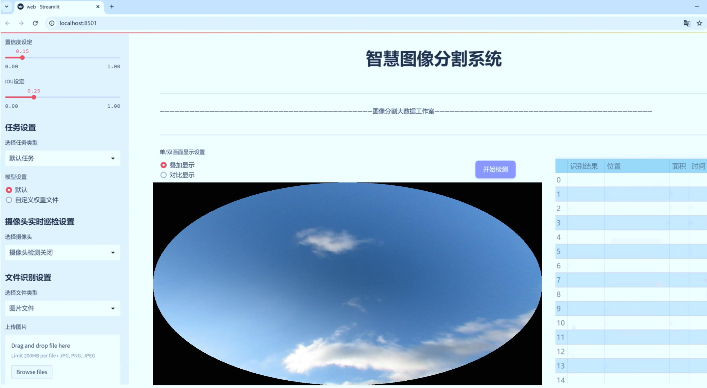
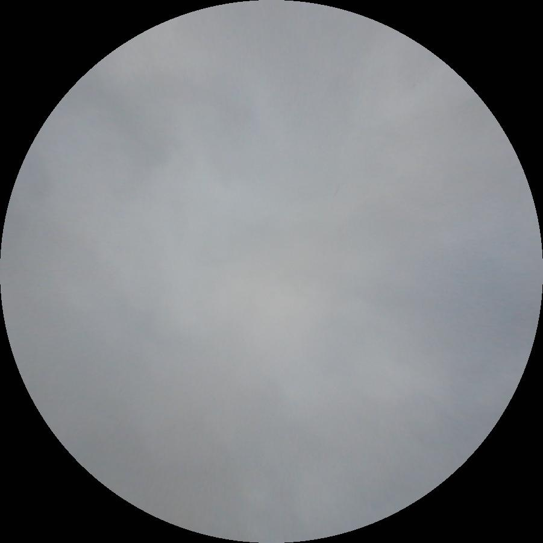
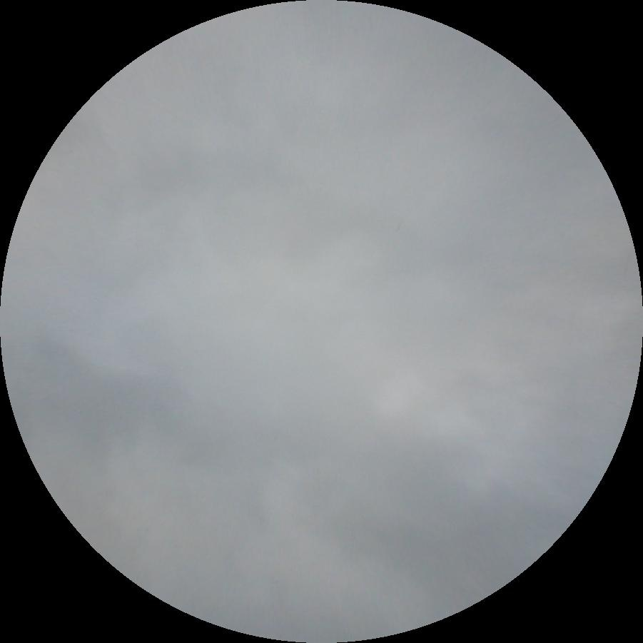
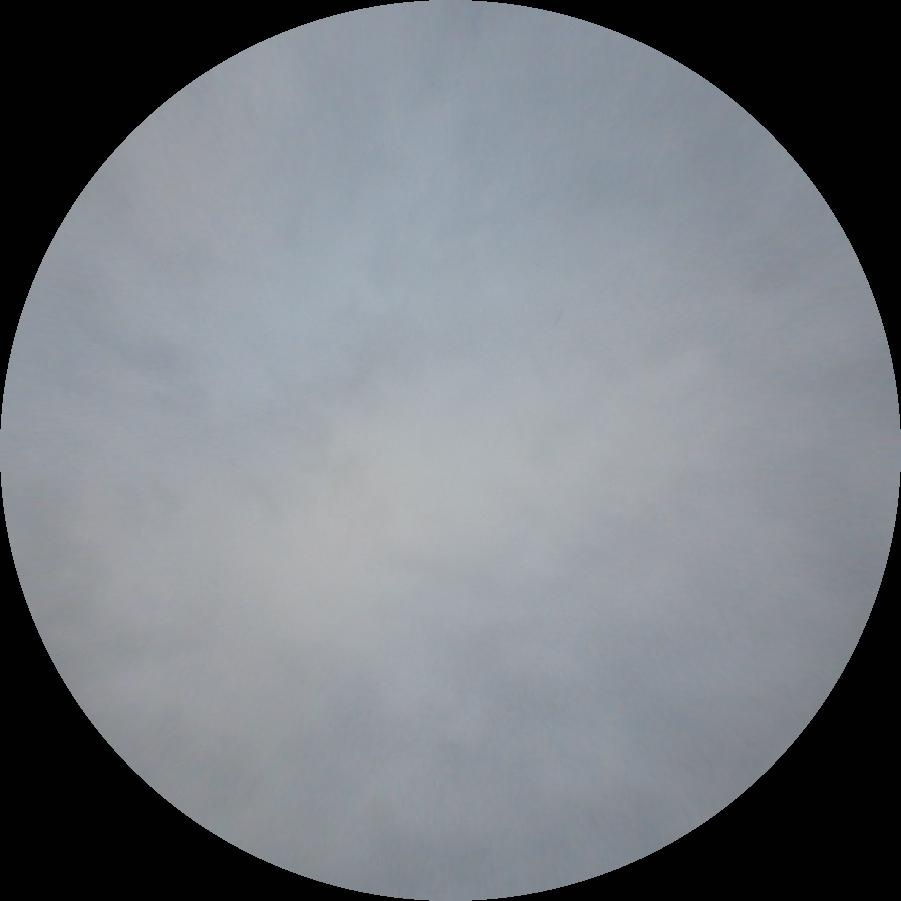
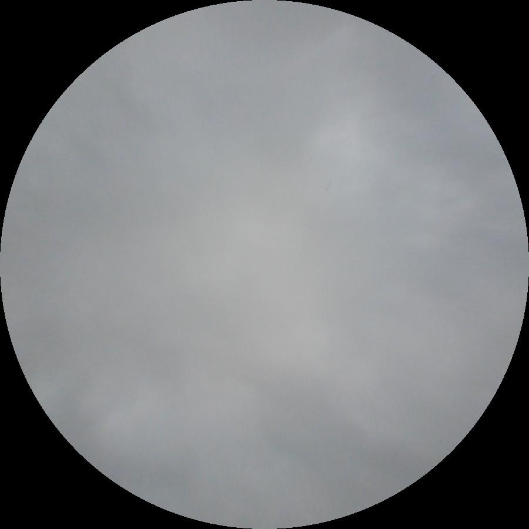
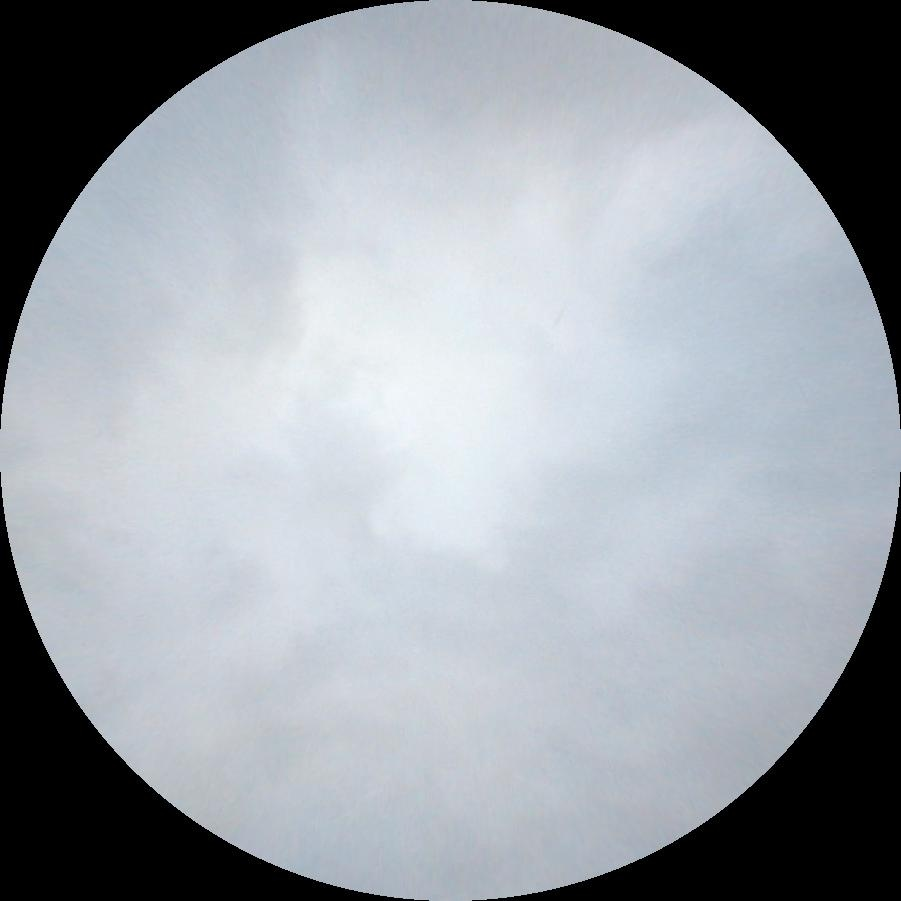

# 飞机尾迹分割系统： yolov8-seg-rtdetr

### 1.研究背景与意义

[参考博客](https://gitee.com/YOLOv8_YOLOv11_Segmentation_Studio/projects)

[博客来源](https://kdocs.cn/l/cszuIiCKVNis)

研究背景与意义

随着航空运输业的迅猛发展，飞机在高空飞行过程中所产生的尾迹（contrail）逐渐引起了科学界和社会公众的广泛关注。飞机尾迹不仅对气候变化有潜在影响，还可能对航空安全、环境保护等领域产生重要影响。因此，准确识别和分割飞机尾迹，尤其是在复杂背景下的尾迹类型，成为了计算机视觉和遥感领域的重要研究课题。传统的尾迹检测方法多依赖于人工标注和经验规则，效率低下且易受人为因素影响，难以满足大规模数据处理的需求。

近年来，深度学习技术的快速发展为尾迹分割提供了新的解决方案。YOLO（You Only Look Once）系列模型因其高效的实时目标检测能力而受到广泛应用。特别是YOLOv8模型，凭借其在特征提取和处理速度上的优势，成为了处理复杂场景下目标检测和分割任务的理想选择。然而，针对飞机尾迹的特定特征，YOLOv8模型仍需进行改进，以提高其在尾迹分割任务中的准确性和鲁棒性。

本研究基于改进YOLOv8的飞机尾迹分割系统，旨在利用丰富的尾迹数据集信息，提升模型在不同尾迹类型下的分割性能。该数据集包含1600幅图像，涵盖了七个类别的尾迹类型，包括“contrail maybe”、“contrail old”、“contrail veryold”、“contrail young”、“parasite”、“sun”和“unknown”。这些类别的多样性为模型的训练提供了良好的基础，能够帮助模型学习到不同尾迹的特征和背景信息，从而实现更为精确的分割。

通过对YOLOv8模型的改进，本研究将重点关注以下几个方面：首先，优化模型的特征提取网络，以增强其对尾迹细节的捕捉能力；其次，结合多尺度特征融合技术，提高模型在不同分辨率下的分割效果；最后，利用数据增强技术扩展训练样本的多样性，提升模型的泛化能力。这些改进措施将使得模型在面对复杂背景和多变环境时，依然能够保持较高的分割精度。

本研究的意义不仅在于推动飞机尾迹分割技术的发展，更在于为航空气候影响研究提供可靠的数据支持。通过精确的尾迹分割，研究人员可以更好地分析尾迹对气候变化的影响，进而为制定相应的环境保护政策提供科学依据。此外，改进后的分割系统也可以应用于其他领域，如遥感影像分析、环境监测等，具有广泛的应用前景。

综上所述，基于改进YOLOv8的飞机尾迹分割系统的研究，不仅填补了现有技术在尾迹分割领域的空白，也为相关领域的研究提供了新的思路和方法。通过本研究的开展，期望能够为航空运输的可持续发展和环境保护贡献一份力量。

### 2.图片演示







注意：本项目提供完整的训练源码数据集和训练教程,由于此博客编辑较早,暂不提供权重文件（best.pt）,需要按照6.训练教程进行训练后实现上图效果。

### 3.视频演示

[3.1 视频演示](https://www.bilibili.com/video/BV1ChBsYVEVQ/)

### 4.数据集信息

##### 4.1 数据集类别数＆类别名

nc: 7
names: ['contrail maybe', 'contrail old', 'contrail veryold', 'contrail young', 'parasite', 'sun', 'unknow']


##### 4.2 数据集信息简介

数据集信息展示

在现代航空领域，飞机尾迹的检测与分割成为了研究的热点之一。为了有效地训练改进YOLOv8-seg的飞机尾迹分割系统，我们构建了一个名为“contrail_seg1”的数据集。该数据集专注于对飞机尾迹的多样性进行细致的分类，涵盖了七个不同的类别，旨在提高模型对不同类型尾迹的识别能力和分割精度。

“contrail_seg1”数据集的类别数量为七个，具体类别包括：‘contrail maybe’、‘contrail old’、‘contrail veryold’、‘contrail young’、‘parasite’、‘sun’以及‘unknow’。这些类别的设定不仅反映了飞机尾迹的不同生长阶段和状态，还考虑到了可能影响尾迹形成的外部因素。每个类别都代表了特定的尾迹特征，便于模型在训练过程中进行更为细致的学习和识别。

首先，‘contrail maybe’类别主要用于标识那些尚未完全形成或不太明显的尾迹。这类尾迹通常在气象条件不佳或飞机飞行高度较低时出现，具有一定的不确定性。其次，‘contrail young’类别则代表了刚刚形成的尾迹，通常呈现出较为清晰的形态，便于模型进行初步的识别和分割。

随着时间的推移，尾迹会经历不同的老化阶段，因此我们将其分为‘contrail old’和‘contrail veryold’两个类别。‘contrail old’代表那些已经存在一段时间的尾迹，可能会因气象条件的变化而呈现出不同的形态。而‘contrail veryold’则是指那些几乎完全消散的尾迹，通常在图像中呈现出模糊的轮廓，这对模型的分割能力提出了更高的要求。

此外，数据集中还包含了‘parasite’类别，专门用于标识与飞机尾迹无关的其他物体或现象。这一类别的设定有助于提高模型的准确性，避免将其他物体误判为尾迹。同时，‘sun’类别则用于标识图像中的太阳光照影响，这在尾迹的成像中也起着重要作用。最后，‘unknow’类别则用于处理那些无法明确分类的尾迹或现象，确保数据集的全面性和灵活性。

“contrail_seg1”数据集的构建不仅为改进YOLOv8-seg提供了丰富的训练素材，还为研究人员在飞机尾迹检测与分割领域的深入探索奠定了基础。通过对不同类别的细致划分，模型能够在训练过程中更好地理解和学习尾迹的特征，从而在实际应用中实现更高的分割精度和识别能力。这一数据集的推出，标志着飞机尾迹研究的一个重要进展，为未来的相关研究提供了坚实的基础。











### 5.项目依赖环境部署教程（零基础手把手教学）

[5.1 环境部署教程链接（零基础手把手教学）](https://www.bilibili.com/video/BV1jG4Ve4E9t/?vd_source=bc9aec86d164b67a7004b996143742dc)


[5.2 安装Python虚拟环境创建和依赖库安装视频教程链接（零基础手把手教学）](https://www.bilibili.com/video/BV1nA4VeYEze/?vd_source=bc9aec86d164b67a7004b996143742dc)

### 6.手把手YOLOV8-seg训练视频教程（零基础手把手教学）

[6.1 手把手YOLOV8-seg训练视频教程（零基础小白有手就能学会）](https://www.bilibili.com/video/BV1cA4VeYETe/?vd_source=bc9aec86d164b67a7004b996143742dc)


按照上面的训练视频教程链接加载项目提供的数据集，运行train.py即可开始训练



     Epoch   gpu_mem       box       obj       cls    labels  img_size
     1/200     0G   0.01576   0.01955  0.007536        22      1280: 100%|██████████| 849/849 [14:42<00:00,  1.04s/it]
               Class     Images     Labels          P          R     mAP@.5 mAP@.5:.95: 100%|██████████| 213/213 [01:14<00:00,  2.87it/s]
                 all       3395      17314      0.994      0.957      0.0957      0.0843

     Epoch   gpu_mem       box       obj       cls    labels  img_size
     2/200     0G   0.01578   0.01923  0.007006        22      1280: 100%|██████████| 849/849 [14:44<00:00,  1.04s/it]
               Class     Images     Labels          P          R     mAP@.5 mAP@.5:.95: 100%|██████████| 213/213 [01:12<00:00,  2.95it/s]
                 all       3395      17314      0.996      0.956      0.0957      0.0845

     Epoch   gpu_mem       box       obj       cls    labels  img_size
     3/200     0G   0.01561    0.0191  0.006895        27      1280: 100%|██████████| 849/849 [10:56<00:00,  1.29it/s]
               Class     Images     Labels          P          R     mAP@.5 mAP@.5:.95: 100%|███████   | 187/213 [00:52<00:00,  4.04it/s]
                 all       3395      17314      0.996      0.957      0.0957      0.0845


### 7.50+种全套YOLOV8-seg创新点加载调参实验视频教程（一键加载写好的改进模型的配置文件）

[7.1 50+种全套YOLOV8-seg创新点加载调参实验视频教程（一键加载写好的改进模型的配置文件）](https://www.bilibili.com/video/BV1Hw4VePEXv/?vd_source=bc9aec86d164b67a7004b996143742dc)

### YOLOV8-seg算法简介

原始YOLOv8-seg算法原理

YOLOv8-seg算法作为YOLO系列的最新版本，继承并发展了YOLOv5和YOLOv7的核心思想，旨在实现更高效的目标检测与分割。该算法的设计结构包括输入层、主干网络、特征融合层以及解耦头，形成了一个高效的检测框架。YOLOv8-seg的核心在于其对目标检测和分割任务的综合处理能力，特别是在处理复杂场景和小目标时，展现出显著的优势。

在YOLOv8-seg的主干网络中，采用了CSPDarknet的设计理念，具体而言，YOLOv8将YOLOv5中的C3模块替换为C2f模块。C2f模块的引入，不仅实现了模型的轻量化，还保持了检测精度的稳定性。C2f模块的设计灵感来源于ELAN结构，通过引入多个shortcut连接，增强了梯度流动，解决了深层网络中常见的梯度消失问题。该模块由多个CBS（卷积+归一化+SiLU激活）组成，能够有效提取目标的纹理和颜色特征，并通过归一化操作提高网络的收敛速度和效果。

YOLOv8-seg在特征融合层采用了PAN-FPN结构，这一结构的设计旨在充分融合不同层次的特征信息。特征融合的过程分为自下而上的融合和自上而下的传递，确保了浅层特征与高层语义信息的有效结合。在自下而上的阶段，高层特征通过上采样与中层特征进行连接，随后与浅层特征进行融合，从而实现多尺度特征的深度融合。这种设计使得YOLOv8-seg在面对不同尺寸的目标时，能够保持良好的检测性能。

在目标检测方面，YOLOv8-seg采用了Anchor-Free的策略，摒弃了传统的Anchor-Base方法。通过这种方式，YOLOv8-seg能够更灵活地适应不同形状和尺寸的目标，减少了模型对Anchor的依赖，提高了检测的准确性。此外，YOLOv8-seg在损失函数的设计上也进行了创新，使用了VFLLoss作为分类损失，并结合DFLLoss和CIoULoss进行边框回归。这种损失函数的组合，能够有效解决样本不平衡问题，提升模型对小目标的检测能力。

样本匹配策略方面，YOLOv8-seg采用了Task-Aligned的Assigner匹配方式，取代了传统的静态匹配策略。这一策略通过动态调整样本匹配的方式，使得模型在训练过程中能够更好地适应不同的任务需求，提升了模型的泛化能力。YOLOv8-seg在数据预处理阶段，借鉴了YOLOv5的增强策略，采用了马赛克增强、混合增强、空间扰动和颜色扰动等多种手段，以提高模型的鲁棒性和准确性。

在解耦头的设计上，YOLOv8-seg借鉴了YOLOX和YOLOv6的解耦头结构，取消了objectness分支，通过边框回归和目标分类的分离，提高了模型的检测效率。解耦头的输出特征图经过Softmax和卷积计算，最终生成目标的边框预测和类别预测。通过这种设计，YOLOv8-seg能够在保持高效检测的同时，进一步提升检测精度。

总的来说，YOLOv8-seg算法通过一系列创新的设计和优化，展现出在目标检测和分割任务中的强大能力。其主干网络的改进、特征融合的增强、Anchor-Free策略的应用以及解耦头的设计，均为其在复杂场景下的表现提供了有力支持。随着YOLOv8-seg的不断发展与完善，未来在实际应用中，其潜力将进一步被挖掘，为目标检测和分割领域带来更多的可能性。


### 9.系统功能展示（检测对象为举例，实际内容以本项目数据集为准）

图9.1.系统支持检测结果表格显示

  图9.2.系统支持置信度和IOU阈值手动调节

  图9.3.系统支持自定义加载权重文件best.pt(需要你通过步骤5中训练获得)

  图9.4.系统支持摄像头实时识别

  图9.5.系统支持图片识别

  图9.6.系统支持视频识别

  图9.7.系统支持识别结果文件自动保存

  图9.8.系统支持Excel导出检测结果数据


### 10.50+种全套YOLOV8-seg创新点原理讲解（非科班也可以轻松写刊发刊，V11版本正在科研待更新）

#### 10.1 由于篇幅限制，每个创新点的具体原理讲解就不一一展开，具体见下列网址中的创新点对应子项目的技术原理博客网址【Blog】：


[10.1 50+种全套YOLOV8-seg创新点原理讲解链接](https://gitee.com/qunmasj/good)

#### 10.2 部分改进模块原理讲解(完整的改进原理见上图和技术博客链接)【如果此小节的图加载失败可以通过CSDN或者Github搜索该博客的标题访问原始博客，原始博客图片显示正常】
### YOLOv8简介
目前YOLO系列的SOTA模型是ultralytics公司于2023年发布的YOLOv8.按照模型宽度和深度不同分为YOLOv8n、YOLOv8s、YOLOv8m、YOLOv81、YOLOv8x五个版本。本文改进的是 YOLOv8n模型。
YOLOv8的 Backbone采用CSPDarknet结构，它是 Darknet 的一种改进，引入CSP改善网络结构。CSPDarknet把特征图分为两部分，一部分进行卷积操作，另一部分进行跳跃连接，在保持网络深度的同时减少参数量和计算量，提高网络效率。Neck 部分采用特征金字塔PANet[17]，通过自顶向下路径结合和自底向上特征传播进行多尺度融合。损失函数采用了CIloU[18]。YOLOv8的网络结构如图所示。


### ParC融合位置感知循环卷积简介
ParC：Position aware circular convolution


#### Position aware circular convolution
针对于全局信息的提取作者提出了Position aware circular convolution（也称作Global Circular Convolution）。图中左右实际是对于该操作水平竖直两方向的对称，理解时只看左边即可。对于维度为C*H*W的输入，作者先将维度为C*B*1的Position Embedding通过双线性插值函数F调整到适合input的维度C*H*1（以适应不同特征大小输入），并且将PE水平复制扩展到C*H*W维度与输入特征相加。这里作者将PE直接设置成为了可学习的参数。

接下来参考该博客将加入PE的特征图竖直方向堆叠，并且同样以插值的方式得到了适应输入维度的C*H*1大小的卷积核，进行卷积操作。对于这一步卷积，作者将之称为循环卷积，并给出了一个卷积示意图。


但个人感觉实际上这个示意图只是为了说明为什么叫循环卷积，对于具体的计算细节还是根据公式理解更好。


进一步，作者给出了这一步的伪代码来便于读者对这一卷积的理解：y=F.conv2D（torch.cat（xp，xp，dim=2），kV），实际上就是将xp堆叠之后使用了一个“条形（或柱形）”卷积核进行简单的卷积操作。（但这样会导致多一次重复卷积，因此在堆叠示意图中只取了前2*H-1行）

可以看到在示意图中特征维度变化如下：C*(2H-1)*W ---C*H*1--->C*H*W，作者特意带上了通道数，并且并没有出现通道数的改变，那么这里所进行的卷积应该是depth wise卷积，通过对文章后续以及论文源码的阅读可以得知这一步进行的就是DW卷积。（we introduce group convolution and point wise convolution into these modules, which decreases number of parameters without hurting performance.）


由groups = channel可知使用的是DW卷积
通过上面就完成了一次竖直方向的全局信息交流，同样只要在水平方向进行同样的操作即可做到水平方向的全局信息交流。

#### ParC block

通过ParC成功解决了全局信息提取的问题，接下来就是针对2）3）两点进行改进。首先是Meta-Former模块，Meta-Former由Token Mixer和Channel Mixer构成，ParC首先满足了Token Mixer的全局信息提取的要求，并且相较于Attention在计算成本上更低。


这里①中的PWC即point wise conv，进一步验证了我们前面对于深度可分离卷积的想法，而GCC-H/V即是前面所说的ParC-H/V。

①构建了Meta-Former中的Token mixer模块，那么最后剩下的问题就是3），替换掉Attention模块之后模型不再data driven。为了解决这一点作者给出了一个channel wise attention，先将特征图（x,C*H*W）进行global average（a,C*1*1）并输入一个MLP生成一个channel wise的权重（w,C*1*1），再将权重与特征图在通道方向相乘得到输出（output = wx,C*H*W）。

#### ParC net
对于ParC net 的搭建，作者直接基于MobileViT，采用了分叉结构（c）完成了网络的搭建。


具体而言作者保留了MobileViT中浅层具有局部感受野的MobileNetV2结构，而将网络深层的ViT block替换成了ParC block，使网络变成了一个pure ConvNet。


### 11.项目核心源码讲解（再也不用担心看不懂代码逻辑）

#### 11.1 ultralytics\utils\checks.py

以下是对代码中最核心部分的提取和详细中文注释：

```python
import os
import platform
import re
import subprocess
import sys
from pathlib import Path
from typing import Optional

import torch
from ultralytics.utils import LOGGER, ROOT, SimpleNamespace, check_requirements

def parse_requirements(file_path=ROOT.parent / 'requirements.txt', package=''):
    """
    解析 requirements.txt 文件，忽略以 '#' 开头的行和 '#' 后的文本。

    参数:
        file_path (Path): requirements.txt 文件的路径。
        package (str, optional): 使用的 Python 包名，默认为空。

    返回:
        (List[Dict[str, str]]): 解析后的需求列表，每个需求为字典形式，包含 `name` 和 `specifier` 键。
    """
    if package:
        requires = [x for x in metadata.distribution(package).requires if 'extra == ' not in x]
    else:
        requires = Path(file_path).read_text().splitlines()

    requirements = []
    for line in requires:
        line = line.strip()
        if line and not line.startswith('#'):
            line = line.split('#')[0].strip()  # 忽略行内注释
            match = re.match(r'([a-zA-Z0-9-_]+)\s*([<>!=~]+.*)?', line)
            if match:
                requirements.append(SimpleNamespace(name=match[1], specifier=match[2].strip() if match[2] else ''))

    return requirements


def check_version(current: str = '0.0.0', required: str = '0.0.0', name: str = 'version', hard: bool = False) -> bool:
    """
    检查当前版本是否满足所需版本或范围。

    参数:
        current (str): 当前版本或包名。
        required (str): 所需版本或范围（pip 风格格式）。
        name (str, optional): 在警告消息中使用的名称。
        hard (bool, optional): 如果为 True，则在未满足要求时引发 AssertionError。

    返回:
        (bool): 如果满足要求则返回 True，否则返回 False。
    """
    if not current:  # 如果 current 是 '' 或 None
        LOGGER.warning(f'WARNING ⚠️ invalid check_version({current}, {required}) requested, please check values.')
        return True

    # 解析当前版本
    c = parse_version(current)  # '1.2.3' -> (1, 2, 3)
    for r in required.strip(',').split(','):
        op, v = re.match(r'([^0-9]*)([\d.]+)', r).groups()  # 分割 '>=22.04' -> ('>=', '22.04')
        v = parse_version(v)  # '1.2.3' -> (1, 2, 3)
        if op == '==' and c != v:
            return False
        elif op == '!=' and c == v:
            return False
        elif op in ('>=', '') and not (c >= v):  # 如果没有约束则假设 '>=required'
            return False
        elif op == '<=' and not (c <= v):
            return False
        elif op == '>' and not (c > v):
            return False
        elif op == '<' and not (c < v):
            return False

    return True


def check_requirements(requirements=ROOT.parent / 'requirements.txt', exclude=(), install=True, cmds=''):
    """
    检查已安装的依赖项是否满足要求，并尝试自动更新。

    参数:
        requirements (Union[Path, str, List[str]]): requirements.txt 文件的路径，单个包要求字符串，或包要求字符串列表。
        exclude (Tuple[str]): 要排除的包名元组。
        install (bool): 如果为 True，则尝试自动更新不满足要求的包。
        cmds (str): 在自动更新时传递给 pip install 命令的附加命令。

    返回:
        (bool): 如果所有要求都满足则返回 True，否则返回 False。
    """
    check_python()  # 检查 Python 版本
    if isinstance(requirements, Path):  # requirements.txt 文件
        file = requirements.resolve()
        assert file.exists(), f'requirements file {file} not found, check failed.'
        requirements = [f'{x.name}{x.specifier}' for x in parse_requirements(file) if x.name not in exclude]
    elif isinstance(requirements, str):
        requirements = [requirements]

    pkgs = []
    for r in requirements:
        r_stripped = r.split('/')[-1].replace('.git', '')  # 替换 git URL
        match = re.match(r'([a-zA-Z0-9-_]+)([<>!=~]+.*)?', r_stripped)
        name, required = match[1], match[2].strip() if match[2] else ''
        try:
            assert check_version(metadata.version(name), required)  # 检查版本
        except (AssertionError, metadata.PackageNotFoundError):
            pkgs.append(r)

    if pkgs and install:  # 如果有不满足要求的包并且允许安装
        n = len(pkgs)  # 更新的包数量
        LOGGER.info(f"Ultralytics requirements {pkgs} not found, attempting AutoUpdate...")
        try:
            assert is_online(), 'AutoUpdate skipped (offline)'
            subprocess.check_output(f'pip install --no-cache {s}', shell=True)
            LOGGER.info(f"AutoUpdate success ✅, installed {n} packages: {pkgs}")
        except Exception as e:
            LOGGER.warning(f'AutoUpdate failed ❌: {e}')
            return False

    return True


def check_python(minimum: str = '3.8.0') -> bool:
    """
    检查当前 Python 版本是否满足所需的最低版本。

    参数:
        minimum (str): 所需的最低 Python 版本。

    返回:
        (bool): 如果满足要求则返回 True，否则返回 False。
    """
    return check_version(platform.python_version(), minimum, name='Python ', hard=True)
```

### 代码核心部分解释
1. **`parse_requirements`**: 解析 `requirements.txt` 文件，提取出包名和版本要求，并返回一个包含这些信息的列表。
2. **`check_version`**: 检查当前版本是否满足给定的版本要求，支持多种比较操作符（如 `==`, `>=`, `<` 等）。
3. **`check_requirements`**: 检查已安装的依赖项是否满足要求，并在需要时尝试自动更新。
4. **`check_python`**: 检查当前 Python 版本是否满足最低要求。

这些函数是整个代码的核心，负责管理和验证依赖项的安装与版本，确保环境的正确性。

这个文件 `ultralytics/utils/checks.py` 是 Ultralytics YOLO 项目中的一个工具模块，主要用于检查和验证环境配置、依赖项、版本兼容性等。文件中包含多个函数，每个函数都有特定的功能，以下是对文件中主要功能的逐一分析。

首先，文件导入了一系列必要的库，包括标准库和第三方库，如 `requests`、`torch` 和 `cv2`，这些库提供了文件处理、网络请求、深度学习等功能。

`parse_requirements` 函数用于解析 `requirements.txt` 文件，提取出所需的 Python 包及其版本信息。它会忽略以 `#` 开头的注释行，并返回一个包含包名和版本要求的字典列表。

`parse_version` 函数将版本字符串转换为整数元组，方便进行版本比较。它会忽略非数字字符，并在解析失败时返回默认值 `(0, 0, 0)`。

`is_ascii` 函数检查给定字符串是否仅由 ASCII 字符组成，返回布尔值。

`check_imgsz` 函数用于验证图像尺寸是否为给定步幅的倍数。如果不是，它会将其调整为大于或等于给定最小值的最接近的倍数，并返回更新后的尺寸。

`check_version` 函数用于检查当前版本是否满足所需版本或版本范围。它支持多种比较操作符（如 `==`、`>=`、`<=` 等），并在不满足条件时可以选择抛出异常或打印警告信息。

`check_latest_pypi_version` 函数通过访问 PyPI API 获取指定包的最新版本信息，而 `check_pip_update_available` 函数则检查当前安装的包是否有可用更新。

`check_font` 函数用于查找本地字体文件，如果找不到则从指定 URL 下载字体。

`check_python` 函数检查当前 Python 版本是否满足最低要求。

`check_requirements` 函数检查已安装的依赖项是否满足 YOLOv8 的要求，并在需要时尝试自动更新。

`check_torchvision` 函数检查安装的 PyTorch 和 Torchvision 版本是否兼容，确保它们的版本符合预定义的兼容性表。

`check_suffix` 函数检查文件的后缀是否符合要求，`check_yolov5u_filename` 函数则用于更新旧版 YOLOv5 文件名为新版 YOLOv5u 文件名。

`check_file` 和 `check_yaml` 函数用于检查文件是否存在，如果不存在则尝试下载。

`check_imshow` 函数检查当前环境是否支持图像显示，`check_yolo` 函数则返回 YOLO 软件和硬件的摘要信息。

`collect_system_info` 函数收集并打印系统信息，包括操作系统、Python 版本、内存、CPU 和 CUDA 状态。

`check_amp` 函数检查 PyTorch 的自动混合精度（AMP）功能是否正常，确保在训练时不会出现 NaN 损失或零 mAP 结果。

`git_describe` 函数返回 Git 描述信息，提供当前代码的版本信息。

`print_args` 函数用于打印函数参数，方便调试。

`cuda_device_count` 和 `cuda_is_available` 函数用于检查环境中可用的 NVIDIA GPU 数量及其可用性。

总体而言，这个文件提供了一系列实用的工具函数，帮助开发者在使用 YOLO 项目时进行环境和依赖项的检查与管理，确保代码的顺利运行。

#### 11.2 ultralytics\nn\extra_modules\block.py

以下是经过简化和注释的核心代码部分，保留了最重要的类和函数，并对其进行了详细的中文注释：

```python
import torch
import torch.nn as nn
import torch.nn.functional as F

# 定义自适应填充函数
def autopad(k, p=None, d=1):  # kernel, padding, dilation
    """自动填充以保持输出形状相同。"""
    if d > 1:
        k = d * (k - 1) + 1 if isinstance(k, int) else [d * (x - 1) + 1 for x in k]  # 实际的卷积核大小
    if p is None:
        p = k // 2 if isinstance(k, int) else [x // 2 for x in k]  # 自动填充
    return p

# 定义Swish激活函数
class swish(nn.Module):
    def forward(self, x):
        return x * torch.sigmoid(x)

# 定义DyReLU激活函数
class DyReLU(nn.Module):
    def __init__(self, inp, reduction=4, lambda_a=1.0, use_bias=True):
        super(DyReLU, self).__init__()
        self.oup = inp
        self.lambda_a = lambda_a * 2
        self.avg_pool = nn.AdaptiveAvgPool2d(1)

        # 计算压缩后的通道数
        squeeze = inp // reduction
        self.fc = nn.Sequential(
            nn.Linear(inp, squeeze),
            nn.ReLU(inplace=True),
            nn.Linear(squeeze, self.oup * 2),  # 输出两个通道
            nn.Sigmoid()  # 使用Sigmoid激活
        )

    def forward(self, x):
        b, c, h, w = x.size()
        y = self.avg_pool(x).view(b, c)  # 平均池化
        y = self.fc(y).view(b, self.oup * 2, 1, 1)  # 通过全连接层
        a1, b1 = torch.split(y, self.oup, dim=1)  # 分割为两个通道
        a1 = (a1 - 0.5) * self.lambda_a + 1.0  # 计算动态激活值
        out = x * a1 + b1  # 计算输出
        return out

# 定义DyHeadBlock类
class DyHeadBlock(nn.Module):
    """DyHead Block，包含三种注意力机制。"""
    def __init__(self, in_channels):
        super().__init__()
        self.spatial_conv = nn.Conv2d(in_channels, in_channels, kernel_size=3, padding=1)  # 空间卷积
        self.task_attn_module = DyReLU(in_channels)  # 任务注意力模块

    def forward(self, x):
        """前向传播函数。"""
        x = self.spatial_conv(x)  # 通过空间卷积
        return self.task_attn_module(x)  # 应用任务注意力

# 定义Fusion类
class Fusion(nn.Module):
    """融合模块，支持多种融合方式。"""
    def __init__(self, inc_list):
        super().__init__()
        self.fusion_conv = nn.ModuleList([nn.Conv2d(inc, inc, 1) for inc in inc_list])  # 每个输入通道的卷积

    def forward(self, x):
        """前向传播函数。"""
        for i in range(len(x)):
            x[i] = self.fusion_conv[i](x[i])  # 对每个输入应用卷积
        return torch.cat(x, dim=1)  # 连接所有输出

# 定义Partial_conv3类
class Partial_conv3(nn.Module):
    """部分卷积模块。"""
    def __init__(self, dim):
        super().__init__()
        self.partial_conv3 = nn.Conv2d(dim, dim, 3, padding=1)  # 3x3卷积

    def forward(self, x):
        """前向传播函数。"""
        x = x.clone()  # 克隆输入以保持原始输入不变
        x = self.partial_conv3(x)  # 应用部分卷积
        return x

# 定义Faster_Block类
class Faster_Block(nn.Module):
    """Faster Block，包含部分卷积和MLP。"""
    def __init__(self, inc, dim):
        super().__init__()
        self.spatial_mixing = Partial_conv3(dim)  # 空间混合
        self.mlp = nn.Sequential(
            nn.Conv2d(dim, dim * 2, 1),  # MLP
            nn.Conv2d(dim * 2, dim, 1)
        )

    def forward(self, x):
        """前向传播函数。"""
        x = self.spatial_mixing(x)  # 应用空间混合
        return self.mlp(x)  # 应用MLP

# 定义C3_Faster类
class C3_Faster(nn.Module):
    """C3 Faster Block。"""
    def __init__(self, c1, c2, n=1):
        super().__init__()
        self.m = nn.Sequential(*(Faster_Block(c1, c2) for _ in range(n)))  # 创建多个Faster Block

    def forward(self, x):
        """前向传播函数。"""
        return self.m(x)  # 应用Faster Block序列

# 其他类和函数省略...
```

以上代码保留了最核心的部分，包括自适应填充、激活函数、DyHeadBlock、Fusion、Partial_conv3、Faster_Block 和 C3_Faster 等类，并对每个类和函数进行了详细的中文注释。

这个程序文件 `ultralytics\nn\extra_modules\block.py` 是一个用于构建深度学习模型的模块，主要包含了多种神经网络层和结构，特别是与卷积、注意力机制、残差连接等相关的实现。以下是对文件中主要内容的详细说明。

首先，文件导入了一些必要的库，包括 PyTorch 和其他相关模块。这些库提供了构建和训练神经网络所需的基本功能。

接下来，文件定义了一些辅助函数，例如 `autopad` 用于自动计算卷积层的填充，以确保输出尺寸与输入相同。还有 `_make_divisible` 函数用于确保某些参数是可被特定值整除的，以满足模型设计的要求。

文件中定义了多个类，每个类实现了不同的神经网络层或模块。比如 `swish`、`h_swish` 和 `h_sigmoid` 是几种激活函数的实现。`DyReLU` 是一种动态 ReLU 激活函数，具有可学习的参数，可以根据输入自适应调整激活方式。

`DyHeadBlock` 和 `DyHeadBlockWithDCNV3` 是实现动态头部模块的类，这些模块通常用于目标检测任务中，能够根据特征图的不同层次进行自适应的处理。它们使用了可调节的卷积和注意力机制，以提高模型的性能。

`Fusion` 类实现了特征融合的功能，可以将多个输入特征图进行加权或拼接，以便于后续的处理。`Partial_conv3` 和 `Faster_Block` 是一些用于构建更复杂网络结构的基本模块。

`C3_Faster` 和 `C2f_Faster` 等类则是特定的网络结构实现，通常用于构建高效的卷积神经网络（CNN）。这些类通常会继承自基本的卷积块，并添加额外的功能，比如注意力机制、残差连接等。

文件中还实现了一些更复杂的结构，比如 `Bottleneck_ODConv`、`C3_DySnakeConv`、`C2f_DySnakeConv` 等，这些都是在特定任务中优化的卷积块，能够提高模型的表现。

`PyramidPoolAgg` 和 `AdvPoolFusion` 等类则实现了池化和融合操作，用于在特征图上进行多尺度处理，以捕捉不同尺度的信息。

最后，文件中还定义了一些用于特定任务的模块，比如 `ContextGuidedBlock` 和 `MSBlock`，这些模块通过引入上下文信息或多尺度特征来增强模型的表达能力。

总体而言，这个文件提供了一个丰富的神经网络构建基础，包含了多种层和结构的实现，适用于各种计算机视觉任务，尤其是目标检测和图像分割等。

#### 11.3 ultralytics\models\yolo\pose\train.py

以下是经过简化和注释的核心代码部分：

```python
# 导入必要的库和模块
from copy import copy
from ultralytics.models import yolo
from ultralytics.nn.tasks import PoseModel
from ultralytics.utils import DEFAULT_CFG, LOGGER
from ultralytics.utils.plotting import plot_images, plot_results

class PoseTrainer(yolo.detect.DetectionTrainer):
    """
    PoseTrainer类扩展了DetectionTrainer类，用于基于姿态模型的训练。
    示例用法：
        ```python
        from ultralytics.models.yolo.pose import PoseTrainer

        args = dict(model='yolov8n-pose.pt', data='coco8-pose.yaml', epochs=3)
        trainer = PoseTrainer(overrides=args)
        trainer.train()
        ```
    """

    def __init__(self, cfg=DEFAULT_CFG, overrides=None, _callbacks=None):
        """初始化PoseTrainer对象，使用指定的配置和覆盖参数。"""
        if overrides is None:
            overrides = {}
        overrides['task'] = 'pose'  # 设置任务类型为姿态估计
        super().__init__(cfg, overrides, _callbacks)  # 调用父类构造函数

        # 检查设备类型，如果是Apple MPS，给出警告
        if isinstance(self.args.device, str) and self.args.device.lower() == 'mps':
            LOGGER.warning("WARNING ⚠️ Apple MPS known Pose bug. Recommend 'device=cpu' for Pose models. "
                           'See https://github.com/ultralytics/ultralytics/issues/4031.')

    def get_model(self, cfg=None, weights=None, verbose=True):
        """根据指定的配置和权重获取姿态估计模型。"""
        # 创建PoseModel实例
        model = PoseModel(cfg, ch=3, nc=self.data['nc'], data_kpt_shape=self.data['kpt_shape'], verbose=verbose)
        if weights:
            model.load(weights)  # 加载权重

        return model  # 返回模型

    def set_model_attributes(self):
        """设置PoseModel的关键点形状属性。"""
        super().set_model_attributes()  # 调用父类方法
        self.model.kpt_shape = self.data['kpt_shape']  # 设置关键点形状

    def get_validator(self):
        """返回PoseValidator类的实例，用于验证。"""
        self.loss_names = 'box_loss', 'pose_loss', 'kobj_loss', 'cls_loss', 'dfl_loss'  # 定义损失名称
        return yolo.pose.PoseValidator(self.test_loader, save_dir=self.save_dir, args=copy(self.args))  # 返回验证器实例

    def plot_training_samples(self, batch, ni):
        """绘制一批训练样本，包括标注的类别标签、边界框和关键点。"""
        images = batch['img']  # 获取图像
        kpts = batch['keypoints']  # 获取关键点
        cls = batch['cls'].squeeze(-1)  # 获取类别
        bboxes = batch['bboxes']  # 获取边界框
        paths = batch['im_file']  # 获取图像文件路径
        batch_idx = batch['batch_idx']  # 获取批次索引
        
        # 绘制图像
        plot_images(images,
                    batch_idx,
                    cls,
                    bboxes,
                    kpts=kpts,
                    paths=paths,
                    fname=self.save_dir / f'train_batch{ni}.jpg',  # 保存文件名
                    on_plot=self.on_plot)  # 是否在绘图上显示

    def plot_metrics(self):
        """绘制训练和验证的指标。"""
        plot_results(file=self.csv, pose=True, on_plot=self.on_plot)  # 保存结果图像
```

### 代码注释说明：
1. **导入模块**：导入了所需的库和模块，包括YOLO模型、PoseModel、日志记录和绘图工具。
2. **PoseTrainer类**：该类用于训练姿态估计模型，继承自YOLO的DetectionTrainer类。
3. **构造函数**：初始化时设置任务类型为姿态估计，并处理设备类型的警告。
4. **获取模型**：创建并返回姿态估计模型的实例，可以选择加载预训练权重。
5. **设置模型属性**：设置模型的关键点形状属性。
6. **获取验证器**：返回用于验证的PoseValidator实例，并定义损失名称。
7. **绘制训练样本**：将一批训练样本绘制成图像，显示类别、边界框和关键点。
8. **绘制指标**：绘制训练和验证过程中的指标图。

这个程序文件是一个用于训练姿态估计模型的类，名为 `PoseTrainer`，它继承自 `DetectionTrainer` 类。该类的主要功能是为姿态模型提供训练框架，支持用户自定义配置和参数。

在类的初始化方法 `__init__` 中，首先设置了默认配置和覆盖参数，并指定任务类型为“pose”。如果用户指定的设备是 Apple 的 MPS（Metal Performance Shaders），则会发出警告，建议使用 CPU 进行训练，因为在 MPS 上存在已知的姿态模型问题。

`get_model` 方法用于获取姿态估计模型，用户可以通过指定配置和权重来加载模型。如果提供了权重，模型会加载这些权重。

`set_model_attributes` 方法设置了模型的关键点形状属性，这是姿态模型特有的设置，确保模型能够正确处理输入数据的关键点。

`get_validator` 方法返回一个 `PoseValidator` 实例，用于模型验证。该方法还定义了损失名称，包括边界框损失、姿态损失、关键点对象损失、分类损失和分布式焦点损失。

`plot_training_samples` 方法用于绘制一批训练样本，包括带有注释的类标签、边界框和关键点。它会生成一张包含训练图像的图片，并保存到指定的目录中。

最后，`plot_metrics` 方法用于绘制训练和验证过程中的指标，结果会保存为一张图片，便于用户查看模型的训练效果。

整体而言，这个文件提供了一个完整的姿态模型训练框架，方便用户进行模型训练、验证和结果可视化。

#### 11.4 ultralytics\models\utils\loss.py

以下是代码中最核心的部分，并附上详细的中文注释：

```python
import torch
import torch.nn as nn
import torch.nn.functional as F
from ultralytics.utils.loss import FocalLoss, VarifocalLoss
from ultralytics.utils.metrics import bbox_iou
from .ops import HungarianMatcher

class DETRLoss(nn.Module):
    """
    DETR (DEtection TRansformer) 损失类。该类计算并返回DETR目标检测模型的不同损失组件。
    包括分类损失、边界框损失、GIoU损失，以及可选的辅助损失。
    """

    def __init__(self, nc=80, loss_gain=None, aux_loss=True, use_fl=True, use_vfl=False, use_uni_match=False, uni_match_ind=0):
        """
        初始化DETR损失函数。

        参数:
            nc (int): 类别数量。
            loss_gain (dict): 各损失组件的系数。
            aux_loss (bool): 是否计算辅助损失。
            use_fl (bool): 是否使用FocalLoss。
            use_vfl (bool): 是否使用VarifocalLoss。
            use_uni_match (bool): 是否使用固定层为辅助分支分配标签。
            uni_match_ind (int): 如果`use_uni_match`为True，使用的固定层的索引。
        """
        super().__init__()

        # 初始化损失系数
        if loss_gain is None:
            loss_gain = {'class': 1, 'bbox': 5, 'giou': 2, 'no_object': 0.1, 'mask': 1, 'dice': 1}
        self.nc = nc  # 类别数量
        self.matcher = HungarianMatcher(cost_gain={'class': 2, 'bbox': 5, 'giou': 2})  # 匹配器
        self.loss_gain = loss_gain  # 损失系数
        self.aux_loss = aux_loss  # 是否使用辅助损失
        self.fl = FocalLoss() if use_fl else None  # Focal Loss对象
        self.vfl = VarifocalLoss() if use_vfl else None  # Varifocal Loss对象
        self.use_uni_match = use_uni_match  # 是否使用统一匹配
        self.uni_match_ind = uni_match_ind  # 统一匹配的索引
        self.device = None  # 设备信息

    def _get_loss_class(self, pred_scores, targets, gt_scores, num_gts, postfix=''):
        """计算分类损失。"""
        name_class = f'loss_class{postfix}'  # 分类损失名称
        bs, nq = pred_scores.shape[:2]  # 获取批次大小和查询数量
        one_hot = torch.zeros((bs, nq, self.nc + 1), dtype=torch.int64, device=targets.device)  # 初始化one-hot编码
        one_hot.scatter_(2, targets.unsqueeze(-1), 1)  # 将目标转换为one-hot编码
        one_hot = one_hot[..., :-1]  # 去掉最后一类（背景类）
        gt_scores = gt_scores.view(bs, nq, 1) * one_hot  # 计算真实分数

        # 计算分类损失
        if self.fl:
            if num_gts and self.vfl:
                loss_cls = self.vfl(pred_scores, gt_scores, one_hot)  # 使用VarifocalLoss
            else:
                loss_cls = self.fl(pred_scores, one_hot.float())  # 使用FocalLoss
            loss_cls /= max(num_gts, 1) / nq  # 标准化损失
        else:
            loss_cls = nn.BCEWithLogitsLoss(reduction='none')(pred_scores, gt_scores).mean(1).sum()  # 使用BCE损失

        return {name_class: loss_cls.squeeze() * self.loss_gain['class']}  # 返回分类损失

    def _get_loss_bbox(self, pred_bboxes, gt_bboxes, postfix=''):
        """计算边界框损失和GIoU损失。"""
        name_bbox = f'loss_bbox{postfix}'  # 边界框损失名称
        name_giou = f'loss_giou{postfix}'  # GIoU损失名称

        loss = {}
        if len(gt_bboxes) == 0:  # 如果没有真实边界框
            loss[name_bbox] = torch.tensor(0., device=self.device)
            loss[name_giou] = torch.tensor(0., device=self.device)
            return loss

        # 计算L1损失和GIoU损失
        loss[name_bbox] = self.loss_gain['bbox'] * F.l1_loss(pred_bboxes, gt_bboxes, reduction='sum') / len(gt_bboxes)
        loss[name_giou] = 1.0 - bbox_iou(pred_bboxes, gt_bboxes, xywh=True, GIoU=True)
        loss[name_giou] = loss[name_giou].sum() / len(gt_bboxes)
        loss[name_giou] = self.loss_gain['giou'] * loss[name_giou]
        return {k: v.squeeze() for k, v in loss.items()}  # 返回损失

    def _get_loss(self, pred_bboxes, pred_scores, gt_bboxes, gt_cls, gt_groups, masks=None, gt_mask=None, postfix='', match_indices=None):
        """获取损失。"""
        if match_indices is None:
            match_indices = self.matcher(pred_bboxes, pred_scores, gt_bboxes, gt_cls, gt_groups, masks=masks, gt_mask=gt_mask)

        idx, gt_idx = self._get_index(match_indices)  # 获取匹配索引
        pred_bboxes, gt_bboxes = pred_bboxes[idx], gt_bboxes[gt_idx]  # 根据索引选择预测和真实边界框

        bs, nq = pred_scores.shape[:2]  # 获取批次大小和查询数量
        targets = torch.full((bs, nq), self.nc, device=pred_scores.device, dtype=gt_cls.dtype)  # 初始化目标
        targets[idx] = gt_cls[gt_idx]  # 更新目标

        gt_scores = torch.zeros([bs, nq], device=pred_scores.device)  # 初始化真实分数
        if len(gt_bboxes):
            gt_scores[idx] = bbox_iou(pred_bboxes.detach(), gt_bboxes, xywh=True).squeeze(-1)  # 计算IoU

        loss = {}
        loss.update(self._get_loss_class(pred_scores, targets, gt_scores, len(gt_bboxes), postfix))  # 计算分类损失
        loss.update(self._get_loss_bbox(pred_bboxes, gt_bboxes, postfix))  # 计算边界框损失
        return loss  # 返回总损失

    def forward(self, pred_bboxes, pred_scores, batch, postfix='', **kwargs):
        """
        前向传播，计算损失。

        参数:
            pred_bboxes (torch.Tensor): 预测的边界框。
            pred_scores (torch.Tensor): 预测的分数。
            batch (dict): 包含真实信息的字典。
            postfix (str): 损失名称的后缀。
        """
        self.device = pred_bboxes.device  # 设置设备
        match_indices = kwargs.get('match_indices', None)  # 获取匹配索引
        gt_cls, gt_bboxes, gt_groups = batch['cls'], batch['bboxes'], batch['gt_groups']  # 获取真实标签和边界框

        total_loss = self._get_loss(pred_bboxes[-1], pred_scores[-1], gt_bboxes, gt_cls, gt_groups, postfix=postfix, match_indices=match_indices)  # 计算总损失

        if self.aux_loss:  # 如果使用辅助损失
            total_loss.update(self._get_loss_aux(pred_bboxes[:-1], pred_scores[:-1], gt_bboxes, gt_cls, gt_groups, match_indices, postfix))  # 计算辅助损失

        return total_loss  # 返回总损失
```

### 代码说明：
1. **DETRLoss类**：这是一个继承自`nn.Module`的类，用于计算DETR模型的损失。它包括分类损失、边界框损失和GIoU损失等。
2. **初始化方法**：设置类的属性，包括类别数量、损失系数、是否使用Focal Loss和Varifocal Loss等。
3. **损失计算方法**：
   - `_get_loss_class`：计算分类损失。
   - `_get_loss_bbox`：计算边界框损失和GIoU损失。
   - `_get_loss`：综合计算所有损失。
4. **前向传播方法**：接受预测的边界框和分数，以及真实的标签和边界框，计算并返回总损失。

这些核心部分是实现DETR模型损失计算的基础，确保模型在训练过程中能够有效地优化其性能。

这个程序文件定义了一个用于目标检测的损失计算类，主要是针对DETR（DEtection TRansformer）模型的损失函数。该类计算并返回多个损失组件，包括分类损失、边界框损失、广义交并比（GIoU）损失，以及可选的辅助损失。

在类的初始化方法中，定义了一些重要的属性，例如类别数量、损失增益系数、是否计算辅助损失、是否使用Focal Loss和Varifocal Loss等。使用HungarianMatcher对象来计算匹配成本和索引，以便在计算损失时进行目标检测的匹配。

该类包含多个私有方法，用于计算不同类型的损失。`_get_loss_class`方法计算分类损失，使用了one-hot编码来处理目标类别，并根据是否使用Focal Loss或Varifocal Loss来计算损失。`_get_loss_bbox`方法计算边界框损失和GIoU损失，如果没有真实边界框，则损失为零。`_get_loss_aux`方法用于计算辅助损失，主要在模型的每个解码器层中使用。

`_get_loss`方法是一个综合方法，负责调用上述各个损失计算方法，并根据匹配索引获取预测的边界框和真实的边界框。`forward`方法是类的入口，接受预测的边界框和分数，以及批次数据，最终返回总损失。

此外，文件中还定义了一个RTDETRDetectionLoss类，继承自DETRLoss类，增加了对去噪训练损失的支持。该类的`forward`方法除了计算标准的检测损失外，还会根据提供的去噪元数据计算去噪损失。

总的来说，这个文件实现了一个复杂的损失计算机制，适用于DETR及其变种模型，支持多种损失类型和灵活的配置选项，以便在训练过程中优化目标检测性能。

#### 11.5 ultralytics\nn\backbone\lsknet.py

以下是经过简化并添加详细中文注释的核心代码部分：

```python
import torch
import torch.nn as nn
from functools import partial

class Mlp(nn.Module):
    """ 多层感知机（MLP）模块 """
    def __init__(self, in_features, hidden_features=None, out_features=None, act_layer=nn.GELU, drop=0.):
        super().__init__()
        out_features = out_features or in_features  # 输出特征数默认为输入特征数
        hidden_features = hidden_features or in_features  # 隐藏层特征数默认为输入特征数
        self.fc1 = nn.Conv2d(in_features, hidden_features, 1)  # 1x1卷积层
        self.dwconv = DWConv(hidden_features)  # 深度卷积层
        self.act = act_layer()  # 激活函数
        self.fc2 = nn.Conv2d(hidden_features, out_features, 1)  # 1x1卷积层
        self.drop = nn.Dropout(drop)  # Dropout层

    def forward(self, x):
        """ 前向传播 """
        x = self.fc1(x)  # 第一层卷积
        x = self.dwconv(x)  # 深度卷积
        x = self.act(x)  # 激活
        x = self.drop(x)  # Dropout
        x = self.fc2(x)  # 第二层卷积
        x = self.drop(x)  # Dropout
        return x


class Attention(nn.Module):
    """ 注意力模块 """
    def __init__(self, d_model):
        super().__init__()
        self.proj_1 = nn.Conv2d(d_model, d_model, 1)  # 1x1卷积用于投影
        self.activation = nn.GELU()  # 激活函数
        self.spatial_gating_unit = LSKblock(d_model)  # 空间门控单元
        self.proj_2 = nn.Conv2d(d_model, d_model, 1)  # 1x1卷积用于投影

    def forward(self, x):
        """ 前向传播 """
        shortcut = x.clone()  # 保存输入用于残差连接
        x = self.proj_1(x)  # 投影
        x = self.activation(x)  # 激活
        x = self.spatial_gating_unit(x)  # 空间门控
        x = self.proj_2(x)  # 投影
        x = x + shortcut  # 残差连接
        return x


class Block(nn.Module):
    """ 基本块，包含注意力和MLP """
    def __init__(self, dim, mlp_ratio=4., drop=0., drop_path=0., act_layer=nn.GELU):
        super().__init__()
        self.norm1 = nn.BatchNorm2d(dim)  # 第一层归一化
        self.norm2 = nn.BatchNorm2d(dim)  # 第二层归一化
        self.attn = Attention(dim)  # 注意力模块
        self.mlp = Mlp(in_features=dim, hidden_features=int(dim * mlp_ratio), act_layer=act_layer, drop=drop)  # MLP模块

    def forward(self, x):
        """ 前向传播 """
        x = x + self.attn(self.norm1(x))  # 注意力模块
        x = x + self.mlp(self.norm2(x))  # MLP模块
        return x


class LSKNet(nn.Module):
    """ LSKNet模型 """
    def __init__(self, img_size=224, in_chans=3, embed_dims=[64, 128, 256, 512], depths=[3, 4, 6, 3]):
        super().__init__()
        self.num_stages = len(depths)  # 模型阶段数

        for i in range(self.num_stages):
            # 创建重叠的Patch嵌入层
            patch_embed = OverlapPatchEmbed(img_size=img_size // (2 ** i), in_chans=in_chans if i == 0 else embed_dims[i - 1], embed_dim=embed_dims[i])
            # 创建Block模块
            block = nn.ModuleList([Block(dim=embed_dims[i]) for _ in range(depths[i])])
            setattr(self, f"patch_embed{i + 1}", patch_embed)  # 将嵌入层添加到模型中
            setattr(self, f"block{i + 1}", block)  # 将Block添加到模型中

    def forward(self, x):
        """ 前向传播 """
        outs = []
        for i in range(self.num_stages):
            patch_embed = getattr(self, f"patch_embed{i + 1}")  # 获取嵌入层
            block = getattr(self, f"block{i + 1}")  # 获取Block
            x, H, W = patch_embed(x)  # 嵌入
            for blk in block:
                x = blk(x)  # 通过Block
            outs.append(x)  # 保存输出
        return outs


class DWConv(nn.Module):
    """ 深度卷积模块 """
    def __init__(self, dim=768):
        super(DWConv, self).__init__()
        self.dwconv = nn.Conv2d(dim, dim, 3, padding=1, groups=dim)  # 深度卷积

    def forward(self, x):
        """ 前向传播 """
        return self.dwconv(x)  # 深度卷积


def lsknet_t(weights=''):
    """ 创建LSKNet_t模型 """
    model = LSKNet(embed_dims=[32, 64, 160, 256], depths=[3, 3, 5, 2])
    if weights:
        model.load_state_dict(torch.load(weights)['state_dict'])  # 加载权重
    return model

if __name__ == '__main__':
    model = lsknet_t()  # 实例化模型
    inputs = torch.randn((1, 3, 640, 640))  # 创建输入张量
    for i in model(inputs):
        print(i.size())  # 打印输出尺寸
```

### 代码核心部分解释：
1. **Mlp类**：实现了一个多层感知机模块，包含两层卷积和一个深度卷积，最后通过Dropout进行正则化。
2. **Attention类**：实现了一个注意力机制，包含两个1x1卷积和一个空间门控单元（LSKblock）。
3. **Block类**：是网络的基本构建块，包含注意力模块和MLP模块，使用BatchNorm进行归一化。
4. **LSKNet类**：整个网络结构，包含多个阶段，每个阶段由Patch嵌入层和多个Block组成。
5. **DWConv类**：实现了深度卷积，用于特征提取。
6. **lsknet_t函数**：用于创建LSKNet_t模型并加载权重。

这个程序文件定义了一个名为 LSKNet 的深度学习模型，主要用于图像处理任务。文件中包含多个类和函数，下面对其进行逐一说明。

首先，程序导入了必要的库，包括 PyTorch 和一些用于构建神经网络的模块。接着，定义了一个名为 `Mlp` 的类，它是一个多层感知机，包含两个卷积层和一个深度卷积层。`Mlp` 类的初始化方法接受输入特征数、隐藏特征数、输出特征数、激活函数和 dropout 比例等参数。前向传播方法中，输入数据经过一系列卷积、激活和 dropout 操作后输出。

接下来是 `LSKblock` 类，它实现了一种特殊的卷积块。该类包含多个卷积层和注意力机制，能够对输入特征进行空间和通道的加权。前向传播中，输入数据经过不同的卷积操作，生成的特征通过拼接和池化得到注意力权重，最终对输入进行加权并返回。

`Attention` 类实现了一个注意力机制，包含两个卷积层和一个 `LSKblock`。它通过对输入进行线性变换和激活，结合 `LSKblock` 的输出，最终将结果与输入相加，形成残差连接。

`Block` 类是一个更复杂的模块，结合了批归一化、注意力机制和多层感知机。它使用了残差连接和随机深度（DropPath）来增强模型的表现。每个 `Block` 中的前向传播会先经过注意力层，再经过多层感知机，最后将结果与输入相加。

`OverlapPatchEmbed` 类负责将输入图像转换为补丁嵌入，使用卷积层对图像进行处理，并进行批归一化。前向传播返回嵌入后的特征图以及其高和宽。

`LSKNet` 类是整个模型的核心，包含多个阶段，每个阶段由补丁嵌入、多个 `Block` 和归一化层组成。模型的初始化方法中，根据给定的参数构建各个阶段的结构。前向传播方法中，输入数据依次经过每个阶段，最终返回各个阶段的输出特征。

`DWConv` 类实现了深度卷积，用于在 `Mlp` 中使用。它通过卷积操作对输入进行处理。

`update_weight` 函数用于更新模型的权重，将加载的权重与模型的权重进行匹配，并更新成功加载的权重。

最后，`lsknet_t` 和 `lsknet_s` 函数分别用于创建不同配置的 LSKNet 模型，并可选择加载预训练权重。主程序部分创建了一个 LSKNet 模型实例，并对随机生成的输入进行前向传播，打印输出特征的尺寸。

整体来看，这个程序实现了一个灵活且强大的图像处理模型，适用于各种计算机视觉任务。

### 12.系统整体结构（节选）

### 程序整体功能和构架概括

该程序是 Ultralytics YOLO 项目的一个组成部分，主要用于计算机视觉任务，特别是目标检测和姿态估计。整体架构包括多个模块，各自负责不同的功能：

1. **检查和验证**：`checks.py` 文件用于检查环境配置、依赖项和版本兼容性，确保模型训练和推理的顺利进行。
2. **网络构建**：`block.py` 文件实现了多种神经网络层和结构，提供了构建深度学习模型的基础组件。
3. **训练框架**：`train.py` 文件为姿态估计模型提供了训练框架，支持用户自定义配置和参数，并实现了训练过程中的可视化功能。
4. **损失计算**：`loss.py` 文件实现了复杂的损失计算机制，适用于目标检测模型，支持多种损失类型和灵活的配置选项。
5. **模型架构**：`lsknet.py` 文件定义了 LSKNet 模型，结合了多种卷积层、注意力机制和多层感知机，适用于图像处理任务。

### 文件功能整理表

| 文件路径                                   | 功能描述                                                       |
|-------------------------------------------|------------------------------------------------------------|
| `ultralytics/utils/checks.py`            | 检查环境配置、依赖项和版本兼容性，确保模型训练和推理的顺利进行。   |
| `ultralytics/nn/extra_modules/block.py`  | 实现多种神经网络层和结构，提供构建深度学习模型的基础组件。         |
| `ultralytics/models/yolo/pose/train.py`  | 提供姿态估计模型的训练框架，支持用户自定义配置和参数，包含可视化功能。 |
| `ultralytics/models/utils/loss.py`       | 实现目标检测模型的损失计算机制，支持多种损失类型和灵活配置选项。   |
| `ultralytics/nn/backbone/lsknet.py`      | 定义 LSKNet 模型，结合卷积层、注意力机制和多层感知机，适用于图像处理任务。 |

这个表格清晰地总结了每个文件的主要功能，便于理解整个项目的架构和模块间的关系。

### 13.图片、视频、摄像头图像分割Demo(去除WebUI)代码

在这个博客小节中，我们将讨论如何在不使用WebUI的情况下，实现图像分割模型的使用。本项目代码已经优化整合，方便用户将分割功能嵌入自己的项目中。
核心功能包括图片、视频、摄像头图像的分割，ROI区域的轮廓提取、类别分类、周长计算、面积计算、圆度计算以及颜色提取等。
这些功能提供了良好的二次开发基础。

### 核心代码解读

以下是主要代码片段，我们会为每一块代码进行详细的批注解释：

```python
import random
import cv2
import numpy as np
from PIL import ImageFont, ImageDraw, Image
from hashlib import md5
from model import Web_Detector
from chinese_name_list import Label_list

# 根据名称生成颜色
def generate_color_based_on_name(name):
    ......

# 计算多边形面积
def calculate_polygon_area(points):
    return cv2.contourArea(points.astype(np.float32))

...
# 绘制中文标签
def draw_with_chinese(image, text, position, font_size=20, color=(255, 0, 0)):
    image_pil = Image.fromarray(cv2.cvtColor(image, cv2.COLOR_BGR2RGB))
    draw = ImageDraw.Draw(image_pil)
    font = ImageFont.truetype("simsun.ttc", font_size, encoding="unic")
    draw.text(position, text, font=font, fill=color)
    return cv2.cvtColor(np.array(image_pil), cv2.COLOR_RGB2BGR)

# 动态调整参数
def adjust_parameter(image_size, base_size=1000):
    max_size = max(image_size)
    return max_size / base_size

# 绘制检测结果
def draw_detections(image, info, alpha=0.2):
    name, bbox, conf, cls_id, mask = info['class_name'], info['bbox'], info['score'], info['class_id'], info['mask']
    adjust_param = adjust_parameter(image.shape[:2])
    spacing = int(20 * adjust_param)

    if mask is None:
        x1, y1, x2, y2 = bbox
        aim_frame_area = (x2 - x1) * (y2 - y1)
        cv2.rectangle(image, (x1, y1), (x2, y2), color=(0, 0, 255), thickness=int(3 * adjust_param))
        image = draw_with_chinese(image, name, (x1, y1 - int(30 * adjust_param)), font_size=int(35 * adjust_param))
        y_offset = int(50 * adjust_param)  # 类别名称上方绘制，其下方留出空间
    else:
        mask_points = np.concatenate(mask)
        aim_frame_area = calculate_polygon_area(mask_points)
        mask_color = generate_color_based_on_name(name)
        try:
            overlay = image.copy()
            cv2.fillPoly(overlay, [mask_points.astype(np.int32)], mask_color)
            image = cv2.addWeighted(overlay, 0.3, image, 0.7, 0)
            cv2.drawContours(image, [mask_points.astype(np.int32)], -1, (0, 0, 255), thickness=int(8 * adjust_param))

            # 计算面积、周长、圆度
            area = cv2.contourArea(mask_points.astype(np.int32))
            perimeter = cv2.arcLength(mask_points.astype(np.int32), True)
            ......

            # 计算色彩
            mask = np.zeros(image.shape[:2], dtype=np.uint8)
            cv2.drawContours(mask, [mask_points.astype(np.int32)], -1, 255, -1)
            color_points = cv2.findNonZero(mask)
            ......

            # 绘制类别名称
            x, y = np.min(mask_points, axis=0).astype(int)
            image = draw_with_chinese(image, name, (x, y - int(30 * adjust_param)), font_size=int(35 * adjust_param))
            y_offset = int(50 * adjust_param)

            # 绘制面积、周长、圆度和色彩值
            metrics = [("Area", area), ("Perimeter", perimeter), ("Circularity", circularity), ("Color", color_str)]
            for idx, (metric_name, metric_value) in enumerate(metrics):
                ......

    return image, aim_frame_area

# 处理每帧图像
def process_frame(model, image):
    pre_img = model.preprocess(image)
    pred = model.predict(pre_img)
    det = pred[0] if det is not None and len(det)
    if det:
        det_info = model.postprocess(pred)
        for info in det_info:
            image, _ = draw_detections(image, info)
    return image

if __name__ == "__main__":
    cls_name = Label_list
    model = Web_Detector()
    model.load_model("./weights/yolov8s-seg.pt")

    # 摄像头实时处理
    cap = cv2.VideoCapture(0)
    while cap.isOpened():
        ret, frame = cap.read()
        if not ret:
            break
        ......

    # 图片处理
    image_path = './icon/OIP.jpg'
    image = cv2.imread(image_path)
    if image is not None:
        processed_image = process_frame(model, image)
        ......

    # 视频处理
    video_path = ''  # 输入视频的路径
    cap = cv2.VideoCapture(video_path)
    while cap.isOpened():
        ret, frame = cap.read()
        ......
```


### 14.完整训练+Web前端界面+50+种创新点源码、数据集获取


# [下载链接：https://mbd.pub/o/bread/Z5ialp1t](https://mbd.pub/o/bread/Z5ialp1t)